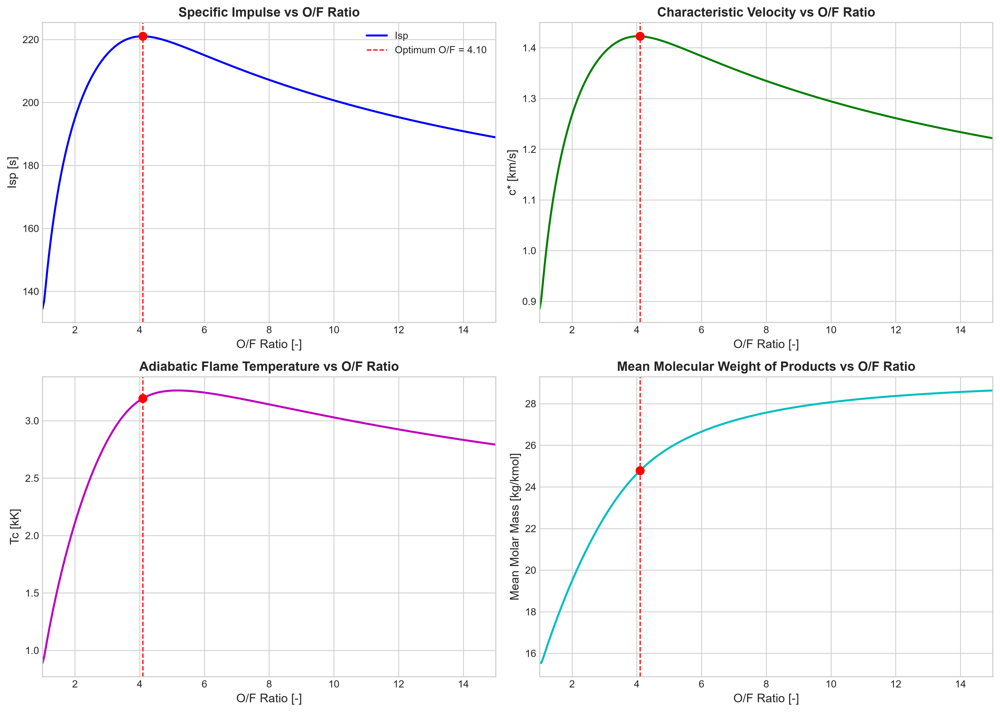
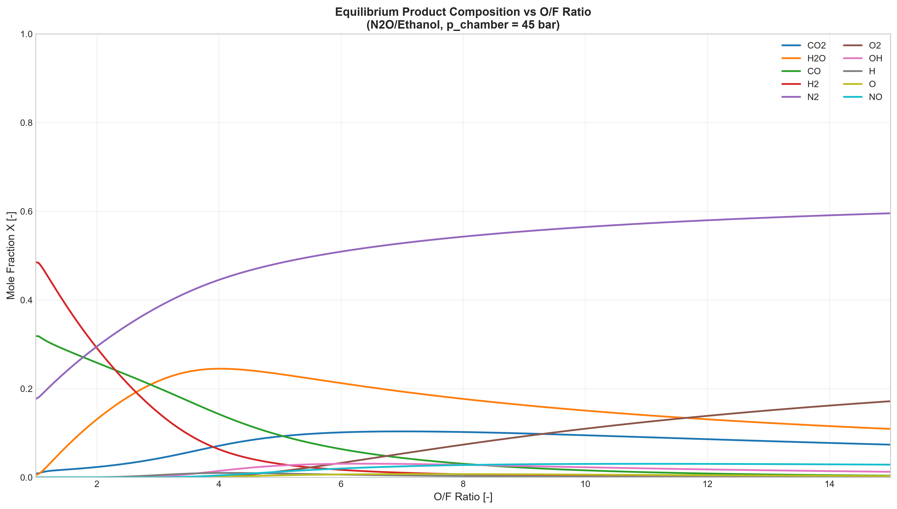
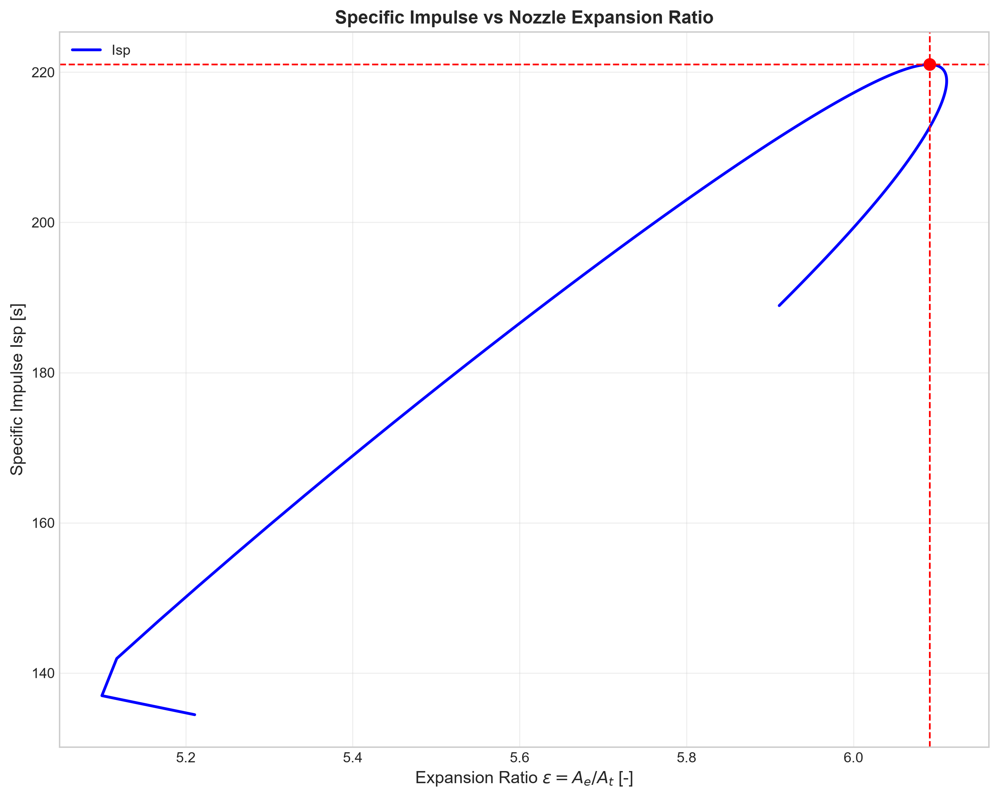

# MKWS 2026 – Thermochemical Optimization of an N₂O/Ethanol Rocket Engine

[](https://python.org)
[](https://cantera.org)

Thermochemical equilibrium analysis and performance optimization of a bipropellant rocket engine burning **N₂O (oxidizer) / C₂H₅OH (fuel)** using the **Cantera** library with the **GRI-Mech 3.0** mechanism.

Project completed as part of the course *"Computer Methods in Combustion" (MKWS 2026)*.

---

## Table of Contents

- [Project Description](#project-description)
- [Results](#results)
- [Requirements](#requirements)
- [Usage](#usage)
- [File Structure](#file-structure)
- [Figures](#figures)
- [References](#references)

---

## Project Description

The goal of the project is to find the optimal oxidizer-to-fuel mass ratio (O/F) for a hypothetical liquid rocket engine burning N₂O and ethanol, under the following assumptions:

| Parameter         | Value  |
|-------------------|--------|
| Chamber pressure  | 45 bar |
| Ambient pressure  | 1 atm  |
| Inlet temperature | 300 K  |

### Methodology

1. **Mechanism generation** – Reduction of GRI-Mech 3.0 to 11 species + addition of ethanol (C₂H₅OH) with NASA7 polynomial coefficients from the Burcat thermodynamic database.
2. **Equilibrium calculations** – For 281 points (O/F = 1.0–15.0, step 0.05), the equilibrium composition was determined using the HP method (constant enthalpy, constant pressure) in Cantera.
3. **Engine parameters** – Computed characteristic velocity `c*`, thrust coefficient `Cf`, nozzle exit pressure, exit Mach number `Me`, nozzle expansion ratio `ε`, and specific impulse `Isp` (objective function) using Vandenkerckhove's isentropic nozzle theory.
4. **Optimization** – Maximization of `Isp` with respect to O/F.

---

## Results

### Optimal operating point

| Parameter                    | Value       | Unit      |
|------------------------------|-------------|-----------|
| **Optimal O/F**              | **4.10**    | –         |
| **Maximum Isp**              | **221.03**  | s         |
| Characteristic velocity c*   | 1422.7      | m/s       |
| Chamber temperature Tc       | 3194.4      | K         |
| Mean molar mass M_mean       | 24.78       | kg/kmol   |
| Isentropic exponent γ        | 1.234       | –         |
| Exit Mach number Me          | 3.000       | –         |
| Expansion ratio ε            | 6.092       | –         |
| Thrust coefficient Cf        | 1.524       | –         |

### Product composition (at O/F = 4.10)

| Species | Mole fraction |
|---------|--------------:|
| N₂      |        45.01% |
| H₂O     |        24.49% |
| CO      |        13.70% |
| CO₂     |         7.39% |
| H₂      |         5.84% |
| OH      |         1.61% |
| H       |         1.00% |
| NO      |         0.51% |
| O₂      |         0.27% |
| O       |         0.17% |

---

## Requirements

- Python 3.10+
- [Cantera](https://cantera.org) 3.2+
- NumPy
- Matplotlib

Install dependencies:

```bash
pip install cantera numpy matplotlib
```

---

## Usage

```bash
# Step 1 – generate the mechanism file (only once)
python generate_yaml.py

# Step 2 – run the optimization (generates figures and console output)
python lre_optimization.py

# Step 3 – export CSV tables (optional, for the report)
python export_tables.py
```

Run all scripts from the project root directory.

---

## File Structure

```
.
├── generate_yaml.py          # Cantera mechanism generator
├── lre_optimization.py       # Main optimization script
├── export_tables.py          # CSV table export script
├── README.md                 # This file
├── Raport_MKWS2026_ML.pdf    # Full report (PDF, Polish)
├── mechanisms/
│   └── n2o_ethanol.yaml      # N₂O/ethanol Cantera mechanism
├── figures/
│   ├── lre_performance.png   # Isp, c*, Tc, M_mean vs O/F
│   ├── lre_composition.png   # Product composition vs O/F
│   └── lre_isp_vs_epsilon.png# Isp vs nozzle expansion ratio
└── tables/
    ├── performance_sweep.csv # Full O/F sweep (281 points)
    ├── optimal_point.csv     # Metrics at the optimal point
    └── composition_optimal.csv# Composition at optimal O/F
```

---

## Figures


*Engine parameters as a function of O/F ratio: Isp, c*, Tc, mean molar mass.*


*Product species mole fractions as a function of O/F ratio.*


*Specific impulse as a function of nozzle expansion ratio (at optimal O/F).*

---

## References

1. **Sutton, G. P., Biblarz, O.** – *Rocket Propulsion Elements*, 9th ed., Wiley, 2017.
2. **Goodwin, D. G., et al.** – *Cantera: An Object-oriented Software Toolkit for Chemical Kinetics, Thermodynamics, and Transport Processes*, https://cantera.org.
3. **Smith, G. P., et al.** – *GRI-Mech 3.0*, http://combustion.berkeley.edu/gri-mech/.
4. **Burcat, A., Ruscic, B.** – *Third Millennium Ideal Gas and Condensed Phase Thermochemical Database for Combustion*.
5. **Vandenkerckhove, J. A.** – *Isentropic Nozzle Theory* (referenced in Sutton & Biblarz).
